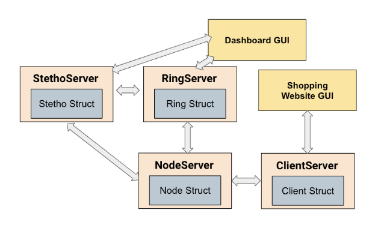

# 50.041 DistSysProject BunshinDB
### System architecture
#### Overview

---

---

System Components:
1. Stethoscope Server -> Checks liveness of Ring Server and Node Servers
2. Ring Server -> Assign Node Servers different positions in the ring and ensures each node is aware of the hash ring
3. Node Servers -> Coordinates read and write requests based on their position on the ring and the hash of the key
4. Client -> Serves as the backend for the shopping website relays get and put requests from the users
5. Shopping Site -> Simple e-commerce web prototype
6. Dashboard GUI -> Visual overlay on the ring structure and the nodes' liveness status

### Run Instructions 

```cassandraql
#To run a nodeServer
go run cmd/nodeServer.go <portNumber> <pathToDbFiles> <nodeId> <shouldRegister true|false> 

#To run a client 
go run cmd/client.go <portNumber> 

```

Note: The last argument, `shouldRegister` is either `"true"` or `"false"`. 
Set it to false if we want to simulate a revival of the node.  

### Dependencies 
github.com/golang/glog
github.com/dgraph-io/badger/

### Setting up 
```cassandraql
go get github.com/golang/glog
go get github.com/dgraph-io/badger/
```

#### Example Usage: 
To run a nodeServer
```cassandraq#
go run cmd/nodeServer.go 8080 /tmp/badger8080 1
help 
```
To run a client 
```cassandraql
go run cmd/client.go 9000
help 
```

Fault Detection 
```cassandraql
go run cmd/ringServer.go
go run cmd/stethoServer.go
go run cmd/nodeServer 8081 /tmp/badger8081 1 true 

```
