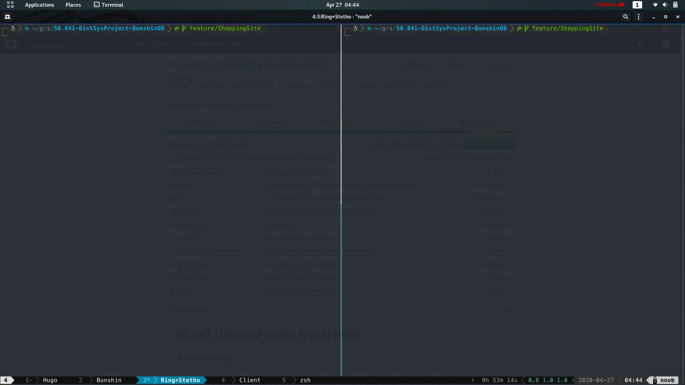
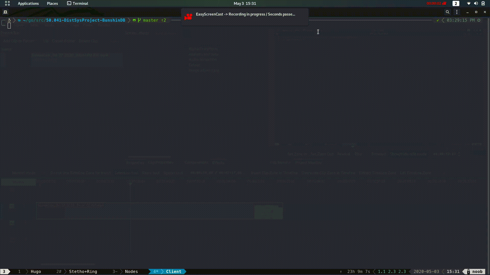

## Why "Bunshin"?

Bunshin (分身) is Japanese term that means "clone" or "replication". It was a word popularised by [Naruto](https://en.wikipedia.org/wiki/Naruto) (ナルト) , one of our favourite Anime Series. (If you haven't watched it, you really should) 

In the series, the main character, Naruto has a signature technique called Kage Bunshin No Jutsu ((影分身の術), which translates to Shadow Replication Technique. By using this technique widely, Naruto was often able to devise interesting battle strategies and survive enemy attacks, triumphing in almost every battle he gets into. In other words, it is his ability to create many clones at once that allows Naruto to be **Highly Available** and  **Fault Tolerant**. 

Additionally, the replication technique in Naruto is not strongly consistent. Turns out, Masashi Kishimoto, (岸本 斉史) the author of Naruto, has taken extra effort to imbue realistic assumptions into this replication technique.  In [Chapter 315](https://naruto.fandom.com/wiki/Special_Training!!) of the manga series, Kakashi, Naruto's sensei, showed Naruto how knowledge transfer works amongst clones. Basically, knowledge amongst the clones of Naruto are synchronised only when a clone disappears -he knowledge of a clone is transferred to all other clones when it disappears. In other words, Naruto's clones are **Eventually Consistent**. By using this technique, Naruto was able to speed up his training and achieve mastery over extremely difficult techniques in record time by having all his clones do the training together. 

Hence, BunshinDB is a fitting name for the system, given how we design our system to be Highly Available, Fault Tolerant and Eventually Consistent, using techniques described in [Amazon's Dynamo] (https://www.allthingsdistributed.com/2007/10/amazons_dynamo.html)


### System architecture

#### Overview

<p align="center">
  
</p>

System Components:
1. Stethoscope Server -> Checks liveness of Ring Server and Node Servers
2. Ring Server -> Assign Node Servers different positions in the ring and ensures each node is aware of the hash ring
3. Node Servers -> Coordinates read and write requests based on their position on the ring and the hash of the key
4. Client -> Serves as the backend for the shopping website relays get and put requests from the users
5. Shopping Site -> Simple e-commerce web prototype
6. Dashboard GUI -> Visual overlay on the ring structure and the nodes' liveness status

### Features
* High availability of Reads and Writes
  * Even load distribution with Consistent Hashing
* Fast and consistent performance
  * Sloppy Quorum allows reads and writes operations to be completed without intermittent failures or congestion affecting the operations
* Fault tolerance
  * Nodes have a set of replicas based on their positions on the ring
  * In the case of temporary failures, data is stored temporarily by the replica and the replicas can serve the requests for the primary
  * In the case of permanent failures, the failed node is removed from the ring and at most K/N keys are reshuffled amongst the remaining N nodes.
* Horizontal scalability
  * Distributed Key Value database across different computers
* Eventually consistent
  * Data versioning with vector clocks ensures that items across different nodes will be up to date eventually

### Dependencies 
```cassandraql
Glog -> github.com/golang/glog
Badger -> github.com/dgraph-io/badger/
Hugo -> https://gohugo.io/
```

### Setting up pre requisites
```cassandraql
go get github.com/golang/glog
go get github.com/dgraph-io/badger/
brew install hugo
```


#### Example Usage of Monitoring Tools 

For better Sanity check, we created a Frontend Monitoring Tool using React, which allows us to know the updated state of the Ring and status of all the Nodes, updated at the resolution of 1 second. 

```bash
#please ensure you have npm installed
cd fe-monitoring 
npm install 
npm run start 
```

Please see below for a gif demo of how the monitoring tool works. 


### DEMO Shopping Site

Static shopping site without Bunshin set up

https://chongyicheng.github.io/BunshinDB/

### Run Instructions 

Execution flow -> Stethoscope -> RingServer -> NodeServer(s) -> Client(s) -> FrontEnd

```cassandraql

#To run a stethoscope
go run cmd/stethoServer.go 

#To run a ringserver
go run cmd/ringServer.go 

```


```cassandraql

#To run a nodeServer
go run cmd/nodeServer.go <portNumber> <pathToDbFiles> <nodeId> <shouldRegister true|false> 

Note: The last argument, `shouldRegister` is either `"true"` or `"false"`. 
Set it to false if we want to simulate a revival of the node.  

```


```cassandraql

#To run a client 
go run cmd/client.go <portNumber> 

```



```cassandraql

#To run frontend

cd ShoppingSite
hugo server

```


#### Example Usage of Shopping Site:
After setting up hugo server, visit localhost:1313 on a web browser.

Shopping Cart data is stored in BunshinDB, easily save and update your shopping cart from any device.


#### Example Usage(CLI): 
To run a nodeServer
```cassandraq#
go run cmd/nodeServer.go 8080 /tmp/badger8080 1
help 
```
To run a client 
```cassandraql
go run cmd/client.go 9000
help 
```

Fault Detection 
```cassandraql
go run cmd/ringServer.go
go run cmd/stethoServer.go
go run cmd/nodeServer 8081 /tmp/badger8081 1 true 

```
